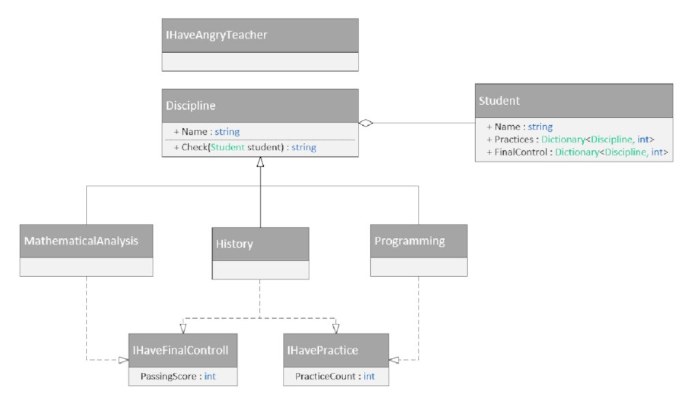
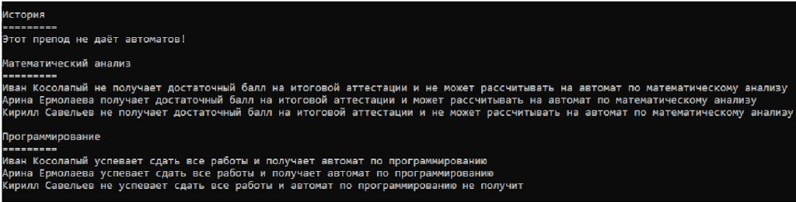

# Лабораторная работа №9. Интерфейсы
---
Итак, вам предстоит разработать информационную систему проверки возможности получения автоматического зачёта «Халява приди». Основная задача информационной системы – вести учёт предметов, по которым у студента возможен автоматический зачёт. Чтобы его получить, необходимо, чтобы у студента были выполнены все практические работы, контрольные/проверочные работы, а также задания на еКурсах. Кроме того, некоторые преподаватели слишком строгие, и не ставят автоматы.
##### Технические требования к информационной системе «Халява приди»:
- базовый абстрактный класс Discipline содержит название этой дисциплины и абстрактный метод string Check(Student student), который будет подготавливать отчёт о ситуации по этому предмету для данного студента (форма отчёта на ваше усмотрение, но должно быть понятно, получает человек автомат или нет).
- интерфейс IHaveAngryTeacher предполагает, что по дисциплине нельзя получить автомат - интерфейс IHavePractice предполагает, что для получения автомата необходимо выполнить определённое количество практических работ (Свойство PracticeCount)
- интерфейс IHaveFinalControll предполагает, что для получения автомата необходимо
пройти финальный тест на определённое количество баллов (Свойство Passing Score) - Классы, являющиеся наследниками класса Discipline
- Класс Student, который хранит своё имя и два словаря: с практическими работами по каждой дисциплине и с оценками по финальным тестам для каждой дисциплины (где это необходимо) 
В качестве возможных дисциплин предлагаются:
- Программирование, где для получения автомата достаточно просто сдать все работы (нет, так только в рамках этой программы, требования вам объявили)
- История, где необходимо сдать все практические работы, чтобы потом получить доступ к финальному тесту, успешно сдав который, студент получает автомат
- Математический анализ, где предполагается сложный финальный тест, который необходимо сдать на определённый балл
Количество необходимых практических работ и проходные баллы финальных тестов выставьте на своё усмотрение. Так же сами определите, на какой дисциплине вы встречаетесь со злым преподавателем.
##### Работа программы
Снова, вводить ничего не нужно. Создайте массив дисциплин. Создайте массив студентов. Дайте студентам ссылки на эти дисциплины и задайте показатели практик и тестов. А после выведите отчёт по каждой дисциплине для каждого студента. Если дисциплина со злым преподавателем, просто напишите, что получить автомат для этой дисциплины невозможно.

