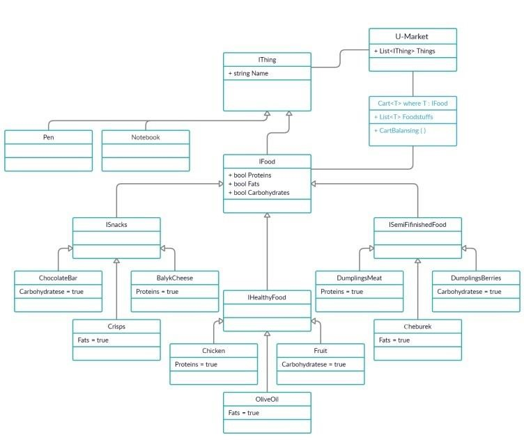

# Практическая работа  №1 - Обобщения

**Техническое задание на разработку информационной системы U-Harchi**

Вам доверено спроектировать и реализовать классы предметной области, которые позволят в дальнейшем вести разработку ИС со следующим функционалом:

1. Осуществлять учет продовольственных и непродовольственных товаров, которыми торгует UMarket СФУ.
2. Предоставлять покупателям возможность фильтрации продовольственных товаров по следующим видам:
    - Снеки;
    - Полуфабрикаты;
    - Продукты для приготовления;
    - Все продовольственные товары.
3. Формировать онлайн корзину из продовольственных товаров.
4. Осуществлять балансировку онлайн корзины с целью получения такого набора продуктов питания, который включает все основные питательные элементы.

**Особенности бизнес-логики сервиса U-Harchi.**

Модуль онлайн покупок должен осуществлять контроль за попадающими в покупательскую корзину продуктами, а именно:

- в онлайн корзину можно добавить только продовольственные товары;
- в зависимости от желания покупателя, в онлайн корзине могут находиться как все присутствующие в U-Market СФУ продовольственные товары, так и исключительно товары той категории, которую выбрал покупатель посредством настроек фильтрации (фильтрация по видам продовольственных товаров).

Необходимо предусмотреть типобсзопасность онлайн корзины, так как в момент «автоматической балансировки» она должна пополняться продовольственными товарами из списка товаров U-Market СФУ. Необходимо учесть, что в случае формирования онлайн корзины конкретного вида продовольственных товаров, дополнять корзину необходимо товарами именно из выбранной покупателем категории продовольственных товаров.

С целью упрощения алгоритма балансировки онлайн корзины, будем считать, что каждый продовольственный продукт содержит всего лишь один питательный элемент: белки / жиры / углеводы. Следовательно, есть вероятность, что все выбранные товары будут представителями одного и того же питательного элемента (например, углеводными). В свою очередь, балансировка делает так, чтобы в корзине были представлены все питательные элементы.

*Пример.*

*Студент принимает решение о формировании онлайн корзины исключительно из снеков: чипсы, шоколадные батончики, смайк’ов и т.п. Следовательно, наши онлайн корзина должна содержать продовольственные товары только той категории. И если в завершении у студента возникает желание сформировать сбалансированный по белкам, жирам и углеводам набор товаров, то ваш уникальный алгоритм должен добавить продукты из списка товаров U-Market, которые содержат недостающий питательный компонент (допустим белок), но именно из категории снеков. Если таких товаров в U-Market нет, требуется вывести сообщение о невозможности сбалансировать корзину товарами данной категории (снеки). По факту, сбалансированная корзина содержит в себе продукты выбранного вида, которые подставляют весь спектр питательных элементов, белки, жиры и углеводы.*

