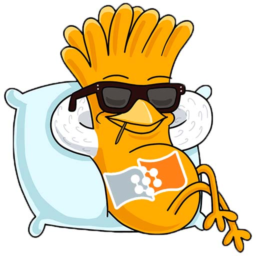

# Практические по Языкам Программирования
___
Практические:
1. Intro - Основы
2. Сonditions and Сycles - Условия и Циклы
3. Arrays - Массивы
4. Processes - Методы
5. Arrays Extra - Дополнительные задачи по массивам
6. Classes - Классы
7. Inheritance - Наследование

